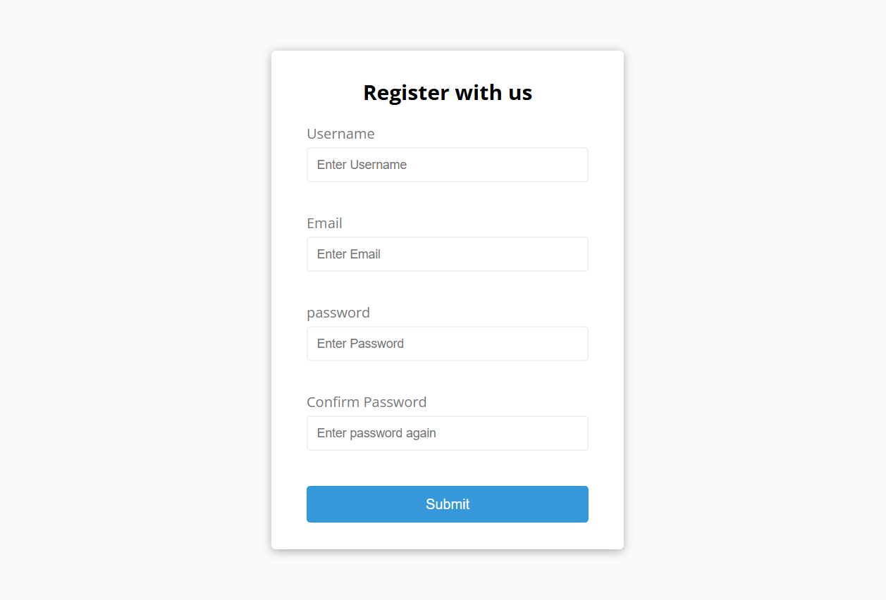

# Form Validator

A simple, responsive form validation web app built with HTML, CSS, and JavaScript.  
This project validates user inputs like username, email, password, and confirm password fields with real-time error messages.

🚀 Live Demo

[View Project](http://www.formvalidator.com/)

## Features

- Validates empty fields  
- Validates proper email format  
- Checks password length and match between password and confirm password  
- Responsive design for mobile and desktop  
- User-friendly error messages  

## Technologies Used

- HTML5  
- CSS3  
- JavaScript (Vanilla)

## How to Use

1. Clone or download this repository.  
2. Open `index.html` in your browser.  
3. Fill the form and submit to see validation in action.

## Screenshot

   

## License

This project is open source and available under the [MIT License](LICENSE).

 

Feel free to contribute and improve this project!

